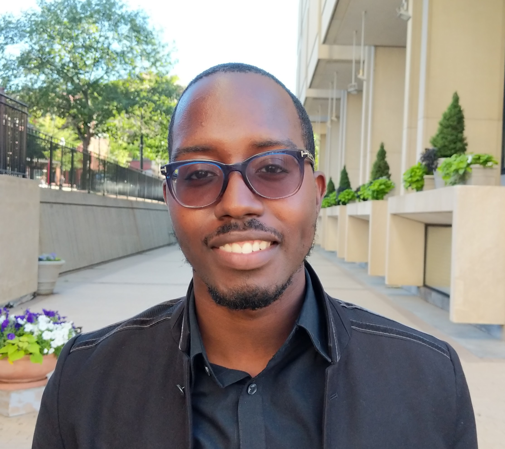

you can veiw my resume [here](about.html).

## Brief Bio
Currently, I am a first-year graduate student in the MS in Biostatistics program at
Columbia University Mailman School of Public Health. I am also a research intern at the Center for Biostatistics at the Icahn School of Medicine at Mount Sinai under the mentorship of Dr. Emma Benn and Dr. Liangyuan Hu.  I am interested in problems that involve but not limited to [time series analysis](https://towardsdatascience.com/almost-everything-you-need-to-know-about-time-series-860241bdc578), [functional data analysis](https://www.displayr.com/what-is-functional-data-analysis/), and [google trend data](trends.google.com). 

